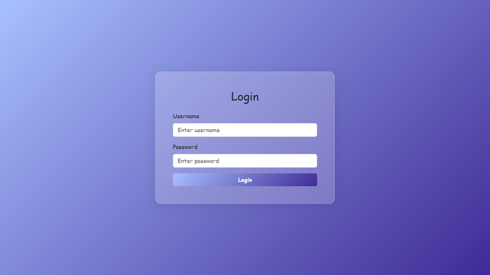

# Login Form with Glassmorphism and Password Strength Indicator

This repository contains a responsive login form built using HTML, CSS (with Bootstrap and custom styling), and JavaScript. The form includes a stylish glassmorphism effect for a modern look and features a dynamic password strength indicator.

## Features

- **Glassmorphism Design**: The form container has a glassmorphism effect, giving it a semi-transparent, frosted-glass appearance that adapts well to various screen sizes.
- **Responsive Layout**: The layout adjusts automatically based on screen size, providing an optimized display for both mobile and desktop devices.
- **Password Strength Indicator**: The password input field includes a real-time strength checker. As the user types their password, the border and text color of the field change based on password strength:
  - **Weak**: Red
  - **Medium**: Yellow
  - **Strong**: Green

## Technologies Used

- **HTML**: For the structure of the form.
- **Bootstrap 5**: For basic styling and responsiveness.
- **CSS**: For custom styling, including the glassmorphism effect.
- **JavaScript**: For dynamically evaluating password strength.

## Setup and Usage

1. **Clone the Repository**:
   ```bash
   git clone https://github.com/your-username/Login-Form-with-Glassmorphism-and-Password-Strength-Indicator.git
   ```

2. **Open the Project**:
   Navigate to the project folder and open the `index.html` file in your browser.

## File Structure

- `index.html`: Contains the main structure of the login form.
- `styles.css`: Contains custom CSS for glassmorphism and responsive design.
- `script.js`: JavaScript for password strength checking.

## How It Works

1. **HTML Structure**: 
   The form contains fields for a username and password, along with a login button.

2. **CSS (Glassmorphism)**:
   The `.glassmorph-container` class applies the glassmorphism effect by using properties like `backdrop-filter`, `border-radius`, and transparency. The layout is made responsive through media queries.

3. **JavaScript (Password Strength)**:
   - The `checkPasswordStrength()` function assesses password strength by checking the length, presence of uppercase letters, and numbers.
   - The color and border of the password input field dynamically change based on the evaluated strength.

## Screenshots



## License

This project is licensed under the MIT License.
